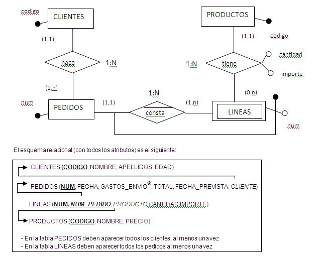
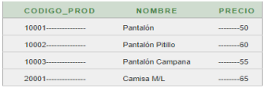

# DAM_BD_UT04_Ejercicios

La empresa El Desván, que se dedica a la rama textil ha decidido informatizar su gestión de pedidos. Para ello BK programación desarrollará para ellos la base de datos. El gerente le ha explicado cómo funciona la gestión de pedidos y Juan, que será quien se encargue de crear el modelo, las tablas y las consultas, ha recogido la siguiente información:

- A cada cliente se le entrega un resguardo con los datos de cada pedido que hace. De cada cliente registraremos su código de cliente, nombre, apellidos, edad.
- Los datos de un pedido son el número, fecha, gastos de envío si los hay, el importe total y fecha prevista de entrega
- Cada pedido consta de varias líneas de producto y cada línea se identifica por un número de línea (1, 2,…) del correspondiente pedido. Una línea contiene la información de un producto (código, nombre, cantidad, importe)


Con todos estos datos se ha llegado al siguiente modelo entidad-relación (a falta de completar con 
el resto de atributos de las entidades):




### ACLARACIONES

En la tabla PEDIDOS el atributo TOTAL es el IMPORTE_TOTAL del pedido pero sin GASTOS DE ENVIO

Tabla Lineas: 
El campo IMPORTE ya tiene calculado la cantidad del producto x precio del producto La columna NUM es el numero de la linea de ese producto en la factura

---

## Consultas

 1 Número e importe total de todos los pedidos realizados en los últimos 60 días.

```sql
SELECT 
	count(num) "Nº Pedidos", 
	sum(total) "Total"
FROM 
	pedidos
WHERE 
	fecha > ( SELECT 
				max(fecha) 
			  FROM 
				pedidos 
			) - 60
```

```
DECLARE

	l_fecha_max DATE;
	l_num_pedidos Pedidos.NUM%TYPE;
	l_sum_total Pedidos.TOTAL%TYPE;
	l_msg VARCHAR2(255);

BEGIN
	
	SELECT 
		MAX(FECHA)
	INTO 
		l_fecha_max  
	FROM 
		pedidos;

	SELECT 
		count(num) "Nº Pedidos",
		sum(total) "Total"
	INTO 
		l_num_pedidos, 
		l_sum_total
	FROM
		pedidos
	WHERE
		fecha > l_fecha_max - 60;
	
	dbms_output.put_line(rpad('-',15,'-'));
	dbms_output.put_line('Nº Pedidos: ' || ' ' || l_num_pedidos);
	dbms_output.put_line('Total: ' || ' ' || l_sum_total);
	dbms_output.put_line(rpad('-',15,'-'));
	
	EXCEPTION 
        WHEN OTHERS THEN
        l_msg := SQLERRM;  
        dbms_output.put_line('Excepción desconocida con mensaje => ' || l_msg);
END;
```

 2 Número e importe de los pedidos cuyo importe esté entre 100 y 200 €

```sql
SELECT 
	num "Nº Pedido", total "Importe"
FROM 
	pedidos
WHERE 
	total BETWEEN 100 AND 200
ORDER BY 
	num
```

```
DECLARE
	
	CURSOR c_pedidos IS
		SELECT 
			num,
			total
		FROM
			pedidos
		WHERE 
			total BETWEEN 100 AND 200
		ORDER BY 
			num;

BEGIN
	
	dbms_output.put_line(rpad('#', 10, '#'));
	dbms_output.put_line(rpad('-', 10, '-'));
	dbms_output.put_line(
		rpad('Num', 5) ||
		rpad('Total', 5)
	);
	dbms_output.put_line(rpad('-', 10, '-'));
	FOR r_pedido IN c_pedidos
	LOOP
		dbms_output.put_line(
		rpad(r_pedido.num,5) ||
		rpad(r_pedido.total, 5)
	);
	dbms_output.put_line(rpad('-', 10, '-'));
	END LOOP;
	dbms_output.put_line(rpad('#', 10, '#'));

END;
```

 3 Código y nombre de los productos ordenados ascendentemente por precio y nombre

```sql
SELECT 
	codigo,
	nombre  
FROM
	productos 
ORDER BY 
	precio, 
	nombre
```

```
DECLARE
	
	CURSOR c_productos IS
		SELECT 
			codigo,
			nombre  
		FROM
			productos 
		ORDER BY 
			precio, 
			nombre;	

BEGIN
	
	dbms_output.put_line('### Resultados ###');
	FOR r_productos IN c_productos
	LOOP
		dbms_output.put_line(r_productos.codigo || ' -- ' || r_productos.nombre);
	END LOOP;
	dbms_output.put_line('### Fin ###');

END;
```

 4 Clientes cuyo segundo apellido sea Perez

```sql
SELECT 
	* 
FROM 
	clientes
WHERE 
	apellidos LIKE '% Perez'
ORDER BY 
	codigo 
```

```
DECLARE
	
	CURSOR c_clientes IS 
		SELECT 
			* 
		FROM 
			clientes
		WHERE 
			apellidos LIKE '% Perez'
		ORDER BY 
			codigo ;

BEGIN
	
	dbms_output.put_line(rpad('-',35,'-'));
	dbms_output.put_line(
			rpad('Cod',5) ||
			rpad('Nombre',10) || 
			rpad('Apellidos',15) ||
			rpad('Edad',5) 
		);
	dbms_output.put_line(rpad('-',35,'-'));
	FOR r_clientes IN c_clientes
	LOOP
		dbms_output.put_line(
			rpad(r_clientes.codigo,5) ||
			rpad(r_clientes.nombre,10) || 
			rpad(r_clientes.apellidos,15) ||
			rpad(r_clientes.edad,5) 
		);
	dbms_output.put_line(rpad('-',35,'-'));
	END LOOP;
END;
```

 5 Número total de productos que vende la empresa (en la columna debe aparecer “Nº de productos”)

```sql
SELECT 
	count(*) AS "Nº de productos"
FROM
	productos
```

 6 Número total de productos que no han sido pedidos


```sql
SELECT 
	count(codigo) AS "Nº de productos no pedidos"
FROM 
	productos
WHERE 
	codigo NOT IN(SELECT producto FROM lineas)
```

```sql
SELECT 
	count(p.codigo) AS "Nº de productos no pedidos"
FROM
	productos p
LEFT JOIN lineas l
	ON l.producto = p.codigo
WHERE 
	l.producto IS NULL 
ORDER BY
	p.codigo
```

 7 De cada pedido, mostrar su número, importe total y datos del cliente

```sql
SELECT 
	p.num AS "Nº de pedido",
	p.total AS "Importe",
	c.codigo AS "Codigo de cliente",
	c.nombre AS "Nombre",
	c.apellidos AS "Apellidos",
	c.edad AS "Edad"
FROM
	pedidos p 
INNER JOIN clientes c
	ON p.cliente = c.codigo	
ORDER BY
	p.num
```

```
DECLARE
	
	CURSOR c_pedidos_clientes IS
		SELECT 
			p.num,
			p.total,
			c.codigo,
			c.nombre,
			c.apellidos,
			c.edad
		FROM
			pedidos p 
		INNER JOIN clientes c
			ON p.cliente = c.codigo	
		ORDER BY
			p.num;

BEGIN
	dbms_output.put_line(rpad('-',65,'-'));
	dbms_output.put_line(
			rpad('Nº', 5) ||
			rpad('Importe', 10) || 
			rpad('Cliente', 10) ||
			rpad('Nombre', 15) ||
			rpad('Apellidos', 20) ||
			lpad('Edad', 5) 
		);
	dbms_output.put_line(rpad('-',65,'-'));
	FOR r_pedidos_clientes IN c_pedidos_clientes
	LOOP
		dbms_output.put_line(
			rpad(r_pedidos_clientes.num,5) ||
			rpad(r_pedidos_clientes.total,10) || 
			rpad(r_pedidos_clientes.codigo,10) ||
			rpad(r_pedidos_clientes.nombre,15) ||
			rpad(r_pedidos_clientes.apellidos,20) ||
			lpad(r_pedidos_clientes.edad,5) 
		);
		dbms_output.put_line(rpad('-',65,'-'));
	END LOOP;
END;
```

 8 Código, nombre del cliente y número total de pedidos que ha hecho cada cliente, ordenado de más a menos pedidos

La Consulta 1 incluiría esos clientes con un conteo de pedidos de 0, mientras que la Consulta 2 los excluiría debido a la combinación interna.

```sql
SELECT 
	p.CLIENTE,
	(SELECT c.nombre || ' ' || c.apellidos FROM clientes c WHERE c.codigo = p.cliente) AS "Datos Cliente",
	count(p.num) AS "Pedidos"
FROM
	pedidos p
GROUP BY
	p.cliente
ORDER BY
	count(p.num) DESC
```

```sql
SELECT 
	p.CLIENTE,	
	c.nombre,
	count(p.num) AS "Pedidos"
FROM
	pedidos p
INNER JOIN clientes c
	ON p.cliente = c.codigo
GROUP BY
	p.cliente, c.nombre
ORDER BY
	count(p.num) DESC
```

 9 Código, nombre del cliente y número total de pedidos que ha realizado cada cliente durante 2016

```sql
SELECT 
	p.CLIENTE,
	(SELECT c.nombre || ' ' || c.apellidos FROM clientes c WHERE c.codigo = p.cliente) AS "Datos Cliente",
	count(p.num) AS "Pedidos"
FROM
	pedidos p
WHERE 
	EXTRACT(YEAR FROM p.FECHA) = '2016'
GROUP BY
	p.cliente
ORDER BY
	count(p.num) DESC
```

```
DECLARE
	
	TYPE t_pedidos_clientes IS RECORD (
		l_cod_cliente pedidos.cliente%TYPE,
		l_nombre_cliente varchar2(64),
		l_cantidad_pedidos varchar2(64)
	);	

	CURSOR c_pedidos_clientes IS
		SELECT 
			p.cliente,
			(SELECT c.nombre || ' ' || c.apellidos FROM clientes c WHERE c.codigo = p.cliente),
			count(p.num)
		FROM
			pedidos p
		WHERE 
			EXTRACT(YEAR FROM p.FECHA) = '2016'
		GROUP BY
			p.cliente
		ORDER BY
			count(p.num) DESC;
		
	r_pedidos_clientes t_pedidos_clientes;

BEGIN
	dbms_output.put_line(rpad('#',5,'#'));
	dbms_output.put_line(rpad('-',40,'-'));
	dbms_output.put_line(
			rpad('Cod', 5) ||
			rpad('Nombre y Apellidos', 25) ||
			lpad('Nº Pedidos', 10) 
		);
	dbms_output.put_line(rpad('-',40,'-'));
	OPEN c_pedidos_clientes;
	LOOP
		FETCH c_pedidos_clientes INTO r_pedidos_clientes;
		EXIT WHEN c_pedidos_clientes%notfound;	
			dbms_output.put_line(
				rpad(r_pedidos_clientes.l_cod_cliente, 5) ||
				rpad(r_pedidos_clientes.l_nombre_cliente, 25) ||
				lpad(r_pedidos_clientes.l_cantidad_pedidos, 10)
			);	
			dbms_output.put_line(rpad('-',40,'-'));
	END LOOP;
	CLOSE c_pedidos_clientes;
	dbms_output.put_line(rpad('#',5,'#'));
	
END;
````

 10 Código, nombre y número total de pedidos de los clientes que han realizado más de un pedido

```sql
SELECT 
	c.codigo, 
	c.nombre || ' ' || c.apellidos AS "Nombre Completo",
	count(p.NUM) AS "Nº Pedidos"
FROM
	clientes c
INNER JOIN
	pedidos p
	ON p.cliente = c.codigo
GROUP BY 
	c.codigo,
	c.nombre,
	c.apellidos
HAVING
	count(p.num) > 1
```

```
DECLARE

	TYPE t_clientes_pedidos IS record(
		l_cod clientes.codigo%TYPE,
		l_nombre varchar2(64),
		l_num_pedidos number
	);

	r_clientes_pedidos t_clientes_pedidos;
	
	CURSOR c_clientes_pedidos IS
		SELECT 
			c.codigo, 
			c.nombre || ' ' || c.apellidos,
			count(p.NUM)
		FROM
			clientes c
		INNER JOIN
			pedidos p
			ON p.cliente = c.codigo
		GROUP BY 
			C.codigo,
			c.nombre,
			c.apellidos
		HAVING
			count(p.num) > 1
		;
	
BEGIN
	dbms_output.put_line(rpad('#',5,'#'));
	dbms_output.put_line(rpad('-',40,'-'));
	dbms_output.put_line(
			rpad('Cod', 5) ||
			rpad('Nombre y Apellidos', 25) ||
			lpad('Nº Pedidos', 10) 
		);
	dbms_output.put_line(rpad('-',40,'-'));
	OPEN c_clientes_pedidos;
	LOOP
		FETCH c_clientes_pedidos INTO r_clientes_pedidos;
		EXIT WHEN c_clientes_pedidos%notfound;
			dbms_output.put_line(
				rpad(r_clientes_pedidos.l_cod,5) ||
				rpad(r_clientes_pedidos.l_nombre, 25) ||
				lpad(r_clientes_pedidos.l_num_pedidos, 10) 
			);		
			dbms_output.put_line(rpad('-',40,'-'));
	END LOOP;
	CLOSE c_clientes_pedidos;
	dbms_output.put_line(rpad('#',5,'#'));
END;
```

 11 Para cada pedido mostrar su número, código del cliente y nº total de líneas que tiene

Ambas consultas están diseñadas para producir los mismos resultados, pueden haber diferencias si hay pedidos sin líneas. La Consulta 1 incluiría esos pedidos con un conteo de líneas de 0, mientras que la Consulta 2 los excluiría debido a la combinación interna

```sql
SELECT 
	p.num,
	p.cliente,
	(	SELECT count(num_pedido)
		FROM lineas l
		WHERE l.num_pedido = p.num
		) AS "Nº Lineas"
FROM
	pedidos p
ORDER BY
	p.num
```

```sql
SELECT 
	p.num,
	p.cliente,
	count(l.num_pedido) AS "Nº Lineas"
FROM
	pedidos p
INNER JOIN
	lineas l
	ON l.num_pedido = p.num
GROUP BY 
	p.num, p.CLIENTE
ORDER BY
	p.num
```

 12 Código de cliente, nombre de producto y cantidad total que ha pedido cada cliente de cada producto

```sql
SELECT 
	p.cliente,
	pr.nombre,
	sum(l.cantidad) AS "Cantidad"
FROM
	pedidos p
INNER JOIN 
	lineas l
	ON l.num_pedido = p.num
INNER JOIN 
	productos pr
	ON pr.codigo = l.producto
GROUP BY 
	p.cliente,
	pr.nombre
ORDER BY 
	p.cliente,
	sum(l.cantidad) DESC 
```

```
DECLARE

	TYPE t_clientes_pedidos IS record(
		l_cod pedidos.cliente%TYPE,
		l_nombre varchar2(64),
		l_cantidad number
	);
	
	r_clientes_pedidos t_clientes_pedidos;
	
	CURSOR c_clientes_pedidos IS
		SELECT 
			p.cliente,
			pr.nombre,
			sum(l.cantidad)
		FROM
			pedidos p
		INNER JOIN 
			lineas l
			ON l.num_pedido = p.num
		INNER JOIN 
			productos pr
			ON pr.codigo = l.producto
		GROUP BY 
			p.cliente,
			pr.nombre
		ORDER BY 
			p.cliente,
			sum(l.cantidad) DESC;
			
BEGIN
	dbms_output.put_line(rpad('#',5,'#'));
	dbms_output.put_line(rpad('-',35,'-'));
	dbms_output.put_line(
			rpad('Cod', 5) ||
			rpad('Nombre y Apellidos', 20) ||
			lpad('Cantidad', 10) 
		);
	dbms_output.put_line(rpad('-',35,'-'));
	OPEN c_clientes_pedidos;
	LOOP
		FETCH c_clientes_pedidos INTO r_clientes_pedidos;
		EXIT WHEN c_clientes_pedidos%notfound;
		dbms_output.put_line(
				rpad(r_clientes_pedidos.l_cod, 5) ||
				rpad(r_clientes_pedidos.l_nombre, 20) ||
				lpad(r_clientes_pedidos.l_cantidad, 10) 
			);		
			dbms_output.put_line(rpad('-',35,'-'));		
	END LOOP;	
	CLOSE c_clientes_pedidos;
	dbms_output.put_line(rpad('#',5,'#'));
END;
```

 13 Para cada cliente mostrar su código, nombre , numero e importe total de cada uno de sus pedidos

```sql
SELECT 
	c.codigo,
	c.nombre || ' ' || c.apellidos AS "Nombre completo",
	p.num AS "NºPedido",
	p.total AS "Total"
FROM
	clientes c
INNER JOIN 
	pedidos p
	ON c.codigo  = p.cliente
ORDER BY 
	c.codigo,
	p.total
```

```
DECLARE

	TYPE t_clientes_pedidos IS record(
		l_cod pedidos.cliente%TYPE,
		l_nombre varchar2(64),
		l_num number,
		l_total number
	);

	r_clientes_pedidos t_clientes_pedidos;
	
	CURSOR c_clientes_pedidos IS
		SELECT 
			c.codigo,
			c.nombre || ' ' || c.apellidos,
			p.num,
			p.total
		FROM
			clientes c
		INNER JOIN 
			pedidos p
			ON c.codigo  = p.cliente
		ORDER BY 
			c.codigo,
			p.total DESC;
			
BEGIN
	dbms_output.put_line(rpad('#',5,'#'));
	dbms_output.put_line(rpad('-',45,'-'));
	dbms_output.put_line(
			rpad('Cod', 5) ||
			rpad('Nombre y Apellidos', 30) ||
			rpad('Nº', 5) ||
			lpad('Total', 5) 
		);
	dbms_output.put_line(rpad('-',45,'-'));
	OPEN c_clientes_pedidos;
	LOOP
		FETCH c_clientes_pedidos INTO r_clientes_pedidos;
		EXIT WHEN c_clientes_pedidos%notfound;
		dbms_output.put_line(
				rpad(r_clientes_pedidos.l_cod, 5) ||
				rpad(r_clientes_pedidos.l_nombre, 30) ||
				rpad(r_clientes_pedidos.l_num, 5) ||
				lpad(r_clientes_pedidos.l_total, 5) 
			);		
			dbms_output.put_line(rpad('-',45,'-'));		
	END LOOP;	
	CLOSE c_clientes_pedidos;
	dbms_output.put_line(rpad('#',5,'#'));
END;
```
 14 Para cada cliente menor de edad mostrar su código y nombre, el importe total más alto, el más 
bajo de los pedidos que ha realizado

```sql
SELECT 
	c.codigo,
	c.nombre || ' ' || c.apellidos AS "Nombre completo",
	max(p.total) AS "Máximo",
	min(p.total) AS "Mínimo"
FROM
	clientes c
INNER JOIN 
	pedidos p
	ON c.codigo  = p.cliente
WHERE 
	c.edad < 18
GROUP BY 
	c.codigo,
	c.nombre,
	c.apellidos
ORDER BY 
	c.codigo
```

```
DECLARE

	TYPE t_clientes_pedidos IS RECORD(
		l_cod clientes.codigo%TYPE,
		l_nombre varchar2(64),
		l_max number,
		l_min number
	);

	r_clientes_pedidos t_clientes_pedidos;
	
	CURSOR c_clientes_pedidos IS
		SELECT 
			c.codigo,
			c.nombre || ' ' || c.apellidos,
			max(p.total),
			min(p.total)
		FROM
			clientes c
		INNER JOIN 
			pedidos p
			ON c.codigo  = p.cliente
		WHERE 
			c.edad < 18
		GROUP BY 
			c.codigo,
			c.nombre,
			c.apellidos
		ORDER BY 
			c.codigo;
			
BEGIN
	dbms_output.put_line(rpad('#',5,'#'));
	dbms_output.put_line(rpad('-',45,'-'));
	dbms_output.put_line(
			rpad('Cod', 5) ||
			rpad('Nombre y Apellidos', 30) ||
			rpad('Max', 5) ||
			lpad('Min', 5) 
		);
	dbms_output.put_line(rpad('-',45,'-'));
	OPEN c_clientes_pedidos;
	LOOP
		FETCH c_clientes_pedidos INTO r_clientes_pedidos;
		EXIT WHEN c_clientes_pedidos%notfound;
		dbms_output.put_line(
				rpad(r_clientes_pedidos.l_cod, 5) ||
				rpad(r_clientes_pedidos.l_nombre, 30) ||
				rpad(r_clientes_pedidos.l_max, 5) ||
				lpad(r_clientes_pedidos.l_min, 5) 
			);		
			dbms_output.put_line(rpad('-',45,'-'));		
	END LOOP;	
	CLOSE c_clientes_pedidos;
	dbms_output.put_line(rpad('#',5,'#'));
END;
```

 15 Mostrar el código del producto, el nº de veces que ha sido pedido y la cantidad total de unidades 
que se han pedido (los que no hayan sido pedidos también deben ser mostrados con estos valores a 
0) (combinación externa)

```sql
SELECT 
	p.codigo,
	count(l.producto) AS "Nº Veces",
	CASE WHEN sum(l.cantidad) IS NULL
		THEN 0
		ELSE sum(l.cantidad)
	END 
	AS "Cantidad"
FROM
	productos p
LEFT JOIN
	lineas l
	ON l.producto = p.codigo
GROUP BY 
	p.codigo
ORDER BY 
	count(l.producto) DESC
```

```
DECLARE

	TYPE t_productos_lineas IS RECORD(
		l_cod productos.codigo%TYPE,
		l_veces number,
		l_cantidad number
	);

	r_productos_lineas t_productos_lineas;
	
	CURSOR c_productos_lineas IS
		SELECT 
			p.codigo,
			count(l.producto) AS "Nº Veces",
			CASE WHEN sum(l.cantidad) IS NULL
				THEN 0
				ELSE sum(l.cantidad)
			END 
			AS "Cantidad"
		FROM
			productos p
		LEFT JOIN
			lineas l
			ON l.producto = p.codigo
		GROUP BY 
			p.codigo
		ORDER BY 
			count(l.producto) DESC ;
	
BEGIN
	dbms_output.put_line(rpad('#',5,'#'));
	dbms_output.put_line(rpad('-',25,'-'));
	dbms_output.put_line(
			rpad('Cod', 5) ||
			lpad('Veces', 10) ||
			lpad('Cantidad', 10) 
		);
	dbms_output.put_line(rpad('-',25,'-'));
	OPEN c_productos_lineas;
	LOOP
		FETCH c_productos_lineas INTO r_productos_lineas;
		EXIT WHEN c_productos_lineas%notfound;
		dbms_output.put_line(
				rpad(r_productos_lineas.l_cod, 5) ||
				lpad(r_productos_lineas.l_veces, 10) ||
				lpad(r_productos_lineas.l_cantidad, 10) 
			);		
			dbms_output.put_line(rpad('-',25,'-'));		
	END LOOP;	
	CLOSE c_productos_lineas;
	dbms_output.put_line(rpad('#',5,'#'));
END;
```

 16 Datos del producto del que más unidades se han pedido

```sql
SELECT
	p.codigo, 
	p.nombre, 
	p.precio
FROM 
	productos p
INNER JOIN
	lineas l
	ON l.producto = p.codigo
HAVING  
 	SUM(l.CANTIDAD) >= ALL (
 		SELECT 
 			SUM(l2.CANTIDAD)
 		FROM
 			lineas l2
 		GROUP BY
 			l2.producto
 	)
GROUP BY
	p.codigo, 
	p.nombre, 
	p.precio
```

```sql
SELECT
	p.codigo, 
	p.nombre, 
	p.precio
FROM 
	productos p
INNER JOIN
	lineas l
	ON l.PRODUCTO = p.codigo
GROUP BY
	p.codigo, 
	p.nombre, 
	p.precio
ORDER BY 
	SUM(CANTIDAD) DESC
FETCH FIRST ROW ONLY
```

 17 Datos del producto más caro del pedido 1

```sql
SELECT
	p.codigo, 
	p.nombre, 
	p.precio
FROM 
	productos p
INNER JOIN
	lineas l
	ON l.producto = p.codigo
WHERE 
	l.NUM_PEDIDO = 1 AND 
	p.PRECIO  >= ALL (	SELECT 
							l2.importe / l2.cantidad
						FROM
							lineas l2
						WHERE 
							l2.NUM_PEDIDO = 1)
```

```
DECLARE

	CURSOR c_productos IS
	SELECT
			p.codigo, 
			p.nombre, 
			p.precio
		FROM 
			productos p
		INNER JOIN
			lineas l
			ON l.producto = p.codigo
		WHERE 
			l.NUM_PEDIDO = 1 AND 
			p.PRECIO  >= ALL (	SELECT 
									l2.importe / l2.cantidad
								FROM
									lineas l2
								WHERE 
									l2.NUM_PEDIDO = 1);
						
BEGIN
	dbms_output.put_line(rpad('#',5,'#'));
	dbms_output.put_line(rpad('-',30,'-'));
	dbms_output.put_line(
			rpad('Cod', 10) ||
			rpad('Nombre', 10) ||
			lpad('Precio', 10) 
		);
	dbms_output.put_line(rpad('-',30,'-'));
	FOR r_productos IN c_productos
	LOOP
		dbms_output.put_line(
			rpad(r_productos.codigo, 10) ||
			rpad(r_productos.nombre, 10) ||
			lpad(r_productos.precio, 10) 
		);
	dbms_output.put_line(rpad('-',30,'-'));
	END LOOP;	
	dbms_output.put_line(rpad('#',5,'#'));	
END;
```

 18 Datos del producto más caro de cada pedido (con una consulta correlacionada)

```sql
SELECT
	p.codigo, 
	p.nombre, 
	p.precio,
	l.num_pedido
FROM 
	productos p
INNER JOIN
	lineas l
	ON l.producto = p.codigo
WHERE 
	p.precio >= ALL (
					SELECT 
						l2.importe / l2.cantidad
					FROM
						lineas l2
					WHERE 
						l2.num_pedido = l.num_pedido 
					)
ORDER BY
	l.num_pedido DESC 
```
 
```
DECLARE

	CURSOR c_productos IS
	SELECT
			p.codigo, 
			p.nombre, 
			p.precio,
			l.num_pedido
		FROM 
			productos p
		INNER JOIN
			lineas l
			ON l.producto = p.codigo
		WHERE 
			p.precio >= ALL (
							SELECT 
								l2.importe / l2.cantidad
							FROM
								lineas l2
							WHERE 
								l2.num_pedido = l.num_pedido 
							)
		ORDER BY
			l.num_pedido DESC ;
						
BEGIN
	dbms_output.put_line(rpad('#',5,'#'));
	dbms_output.put_line(rpad('-',40,'-'));
	dbms_output.put_line(
			rpad('Cod', 10) ||
			rpad('Nombre', 10) ||
			lpad('Precio', 10) ||
			lpad('NºPedido', 10) 
		);
	dbms_output.put_line(rpad('-',40,'-'));
	FOR r_productos IN c_productos
	LOOP
		dbms_output.put_line(
			rpad(r_productos.codigo, 10) ||
			rpad(r_productos.nombre, 10) ||
			lpad(r_productos.precio, 10) ||
			lpad(r_productos.num_pedido, 10) 
		);
	dbms_output.put_line(rpad('-',40,'-'));
	END LOOP;	
	dbms_output.put_line(rpad('#',5,'#'));	
END;
```
 
 19 Código de cada cliente y cantidad total que se ha gastado en 2016

```sql
SELECT
	p.cliente AS "Cod" ,
	sum(p.total) AS "Total"
FROM 
	pedidos p
WHERE 
	EXTRACT(YEAR FROM p.FECHA) = 2016
GROUP BY 
	p.cliente
ORDER BY
	sum(p.total) DESC 
```

```
 DECLARE

	TYPE t_productos IS RECORD
	(
		codigo pedidos.cliente%TYPE,
		cantidad number
	);

	CURSOR c_productos IS
		SELECT
		p.cliente AS "Cod" ,
		sum(p.total) AS "Total"
		FROM 
			pedidos p
		WHERE 
			EXTRACT(YEAR FROM p.FECHA) = 2016
		GROUP BY 
			p.cliente
		ORDER BY
			sum(p.total) DESC ;
		
	r_productos t_productos;

BEGIN
	dbms_output.put_line(rpad('#',5,'#'));
	dbms_output.put_line(rpad('-',20,'-'));
	dbms_output.put_line(
			rpad('Cod', 10) ||
			rpad('Cantidad', 10) 
		);
	dbms_output.put_line(rpad('-',20,'-'));
	OPEN c_productos;		
	LOOP
		FETCH c_productos INTO r_productos;
		EXIT WHEN c_productos%notfound;
				dbms_output.put_line(
					rpad(r_productos.codigo, 10) ||
					rpad(r_productos.cantidad, 10) 
				);
			dbms_output.put_line(rpad('-',20,'-'));
	END LOOP;
	CLOSE c_productos;
	dbms_output.put_line(rpad('#',5,'#'));	
END;
 ```
 
 20 Cantidad total gastada y código de cliente de los que menos han gastado en 2016

```sql
SELECT 
	p.cliente AS "Cod",
	sum(p.total) AS "Total"
FROM
	pedidos p
WHERE 
	EXTRACT (YEAR FROM  p.FECHA) = 2016
GROUP BY
	p.cliente 
HAVING
	sum(p.total) <= ALL(
						SELECT 
							SUM(p2.total)	
						FROM
							pedidos p2
						WHERE 
							EXTRACT (YEAR FROM  p2.FECHA) = 2016
						GROUP BY
							p2.cliente 
						)
```

```
DECLARE

	TYPE t_productos IS RECORD
	(
		codigo pedidos.cliente%TYPE,
		cantidad number
	);

	CURSOR c_productos IS
		SELECT 
			p.cliente,
			sum(p.total)
		FROM
			pedidos p
		WHERE 
			EXTRACT (YEAR FROM  p.FECHA) = 2016
		GROUP BY
			p.cliente 
		HAVING
			sum(p.total) <= ALL(
						SELECT 
							SUM(p2.total)	
						FROM
							pedidos p2
						WHERE 
							EXTRACT (YEAR FROM  p2.FECHA) = 2016
						GROUP BY
							p2.cliente 
						);
		
	r_productos t_productos;

BEGIN
	dbms_output.put_line(rpad('#',5,'#'));
	dbms_output.put_line(rpad('-',20,'-'));
	dbms_output.put_line(
			rpad('Cod', 10) ||
			rpad('Cantidad', 10) 
		);
	dbms_output.put_line(rpad('-',20,'-'));
	OPEN c_productos;		
	LOOP
		FETCH c_productos INTO r_productos;
		EXIT WHEN c_productos%notfound;
				dbms_output.put_line(
					rpad(r_productos.codigo, 10) ||
					rpad(r_productos.cantidad, 10) 
				);
			dbms_output.put_line(rpad('-',20,'-'));
	END LOOP;
	CLOSE c_productos;
	dbms_output.put_line(rpad('#',5,'#'));	
END;
```

 21 Para cada cliente mostrar su código y la suma total del importe de sus pedidos y gastos de envÍo

```sql
SELECT 
	p.cliente AS "Cod",
	CASE
		WHEN sum(p.total) IS NULL AND sum(p.gastos_envio) IS NULL
			THEN 0
		WHEN sum(p.gastos_envio) IS NULL
			THEN sum(p.total)
		ELSE 
			sum(p.total) + sum(p.gastos_envio)
	END AS "Sumatorio"
	
FROM
	pedidos p
	
GROUP BY
	p.cliente 
	
ORDER BY
	"Sumatorio" DESC 
```

```
DECLARE

	TYPE t_productos IS RECORD
	(
		codigo pedidos.cliente%TYPE,
		cantidad number
	);

	CURSOR c_productos IS
		SELECT 
			p.cliente AS "Cod",
			CASE
				WHEN sum(p.total) IS NULL AND sum(p.gastos_envio) IS NULL
					THEN 0
				WHEN sum(p.gastos_envio) IS NULL
					THEN sum(p.total)
				ELSE 
					sum(p.total) + sum(p.gastos_envio)
			END AS "Sumatorio"
			
		FROM
			pedidos p
			
		GROUP BY
			p.cliente 
			
		ORDER BY
			"Sumatorio" DESC; 
		
	r_productos t_productos;

BEGIN
	dbms_output.put_line(rpad('#',5,'#'));
	dbms_output.put_line(rpad('-',20,'-'));
	dbms_output.put_line(
			rpad('Cod', 10) ||
			rpad('Cantidad', 10) 
		);
	dbms_output.put_line(rpad('-',20,'-'));
	OPEN c_productos;		
	LOOP
		FETCH c_productos INTO r_productos;
		EXIT WHEN c_productos%notfound;
				dbms_output.put_line(
					rpad(r_productos.codigo, 10) ||
					rpad(r_productos.cantidad, 10) 
				);
			dbms_output.put_line(rpad('-',20,'-'));
	END LOOP;
	CLOSE c_productos;
	dbms_output.put_line(rpad('#',5,'#'));	
END;
```

 22 Número de pedido , importe total y cliente de los pedidos que no tienen gastos de envío (debe aparecer un 0 en la columna de gastos de envío y pon una etiqueta a ese campo)

```sql
SELECT 
	p.num AS "Pedido",
	p.total,
	p.cliente AS "Cliente",
	CASE
		WHEN p.gastos_envio IS NULL
			THEN 0
		ELSE 
			p.gastos_envio
	END AS "Gº Envío"
	
FROM
	pedidos p

WHERE
	p.gastos_envio IS NULL OR p.gastos_envio = 0
	
ORDER BY
	"Pedido"
```

```
DECLARE

	TYPE t_pedidos IS RECORD
	(
		num pedidos.num%TYPE,
		total pedidos.total%TYPE,
		cliente pedidos.cliente%TYPE,
		gastos_envio number
	);

	CURSOR c_pedidos IS
		SELECT 
			p.num AS "Pedido",
			p.total,
			p.cliente AS "Cliente",
			CASE
				WHEN p.gastos_envio IS NULL
					THEN 0
				ELSE 
					p.gastos_envio
			END AS "Gº Envío"
			
		FROM
			pedidos p
		
		WHERE
			p.gastos_envio IS NULL OR p.gastos_envio = 0
			
		ORDER BY
			"Pedido"; 
		
	r_pedidos t_pedidos;

BEGIN
	dbms_output.put_line(rpad('#',5,'#'));
	dbms_output.put_line(rpad('-',40,'-'));
	dbms_output.put_line(
			rpad('Num', 10) ||
			rpad('Total', 10)  ||
			lpad('Cliente', 10)  ||
			lpad('Gº Envio', 10) 
		);
	dbms_output.put_line(rpad('-',40,'-'));
	OPEN c_pedidos;		
	LOOP
		FETCH c_pedidos INTO r_pedidos;
		EXIT WHEN c_pedidos%notfound;
				dbms_output.put_line(
					rpad(r_pedidos.num, 10) ||
					rpad(r_pedidos.total, 10) ||
					lpad(r_pedidos.cliente, 10) ||
					lpad(r_pedidos.gastos_envio, 10) 
				);
			dbms_output.put_line(rpad('-',40,'-'));
	END LOOP;
	CLOSE c_pedidos;
	dbms_output.put_line(rpad('#',5,'#'));	
END;
```

 23 Datos del pedido más caro y del más barato

```sql
SELECT 
	p.*	
FROM
	pedidos p 
WHERE 
	p.total >= ALL 
		(
		SELECT	
			max(pp.total) AS "Total"		
		FROM
			pedidos pp
		)
	OR
	p.total <= ALL 
		(
		SELECT	
			min(pp.total) AS "Total"		
		FROM
			pedidos pp
		)
```

```sql
SELECT 
	p.*	
FROM
	pedidos p 
WHERE 
	p.total >= ALL 
		(
		SELECT	
			max(pp.total) AS "Total"		
		FROM
			pedidos pp
		)
		
	UNION
	
SELECT 
	p.*	
FROM
	pedidos p 
WHERE 
	p.total <= ALL 
		(
		SELECT	
			min(pp.total) AS "Total"		
		FROM
			pedidos pp
		)
```
 
 24 Sentencia que muestre los productos con este formato 



```sql

```

 25 Escribe los datos de los pedidos y su clientes con el siguiente formato:


```sql

```

 26 (Solo con subconsultas, sin combinar tablas) Datos de los clientes que han pedido el producto de nombre ‘PANTALON’

```sql

```
 27 (Sin subconsultas) Datos de los clientes que han pedido el producto de nombre ‘PANTALON’

```sql

```
 28 Para cada cliente, mostrar los datos del pedido cuyo importe sea superior al importe l medio de sus pedidos

```sql

```
 29 Lista de todos los pedidos con mostrando también los días previstos de espera para el envío

```sql

```
 30 Pedidos con el mínimo nº de días previsto de espera

```sql

```

