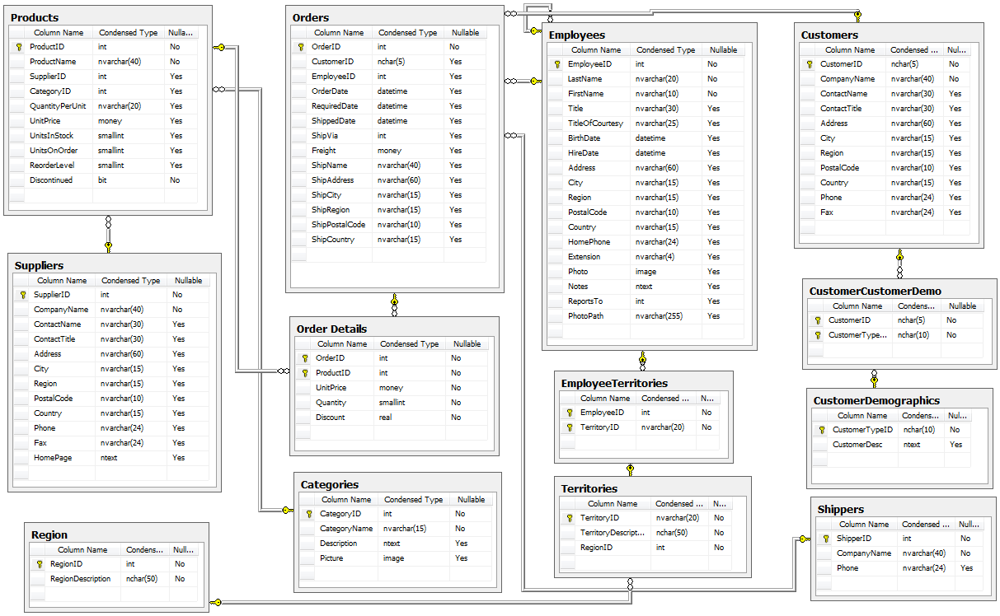
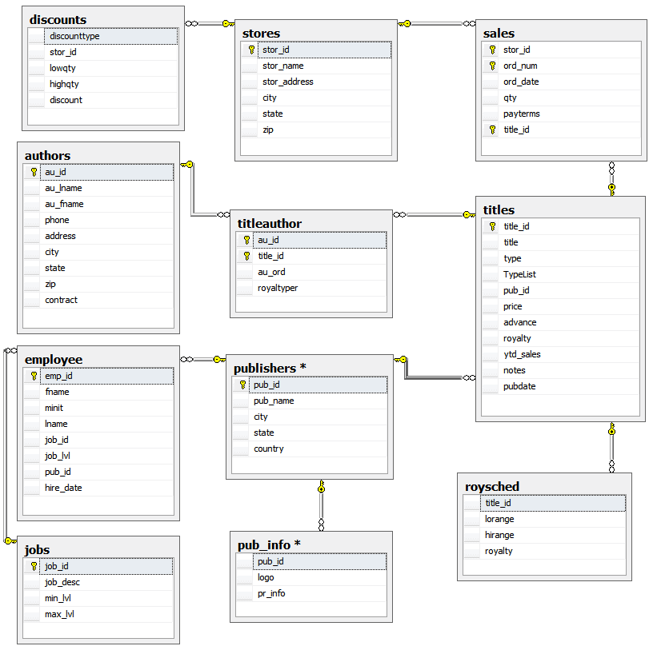

# Northwind & Pubs 01

Consultas para la base de datos de Microsoft "Northwind & Pubs". Originalmente para SQL Server pero portada a Oracle XE

#### Northwind
[](https://github.com/Microsoft/sql-server-samples/tree/master/samples/databases/northwind-pubs)

#### Pubs
[](https://github.com/Microsoft/sql-server-samples/tree/master/samples/databases/northwind-pubs)
 	      
## Consultas   
       
1.Utilizando la base de datos Northwind . Genere una lista de selección de la tabla Employees (Empleado) donde solo se genere una columna de salida y esta contenga los campos: EmployeeID, LastName y FirstName.
   
```sql
SELECT
    employeeid || '/ ' ||
    lastname || ', ' ||
    firstname || '.' AS "Nombre Completo"
FROM
    employees
ORDER BY
    employeeid
```

2.Utilizando la tabla Employees liste las columnas EmployeeID, LastName, FirstName, además envíe dos mensajes en conjunto con cada fila utilizando para cada uno una de las opciones de literales. 

```sql
SELECT
    employeeid AS "Id",
    lastname AS "Apellido",
    firstname AS "Nombre",
    'Indefinido' AS "Contrato",
    'Activo' AS "Estado"
FROM
    employees
ORDER BY
    employeeid
```

3.Suponga que queremos ver aquellos productos (Tabla Products) cuyos valores se encuentran entre los 4 y 20 Dólares. 

```sql
SELECT
    productid,
    productname,
    unitprice,
    discontinued
FROM
    products
WHERE
    unitprice  BETWEEN 4 AND 20
ORDER BY
    unitprice DESC
```

4.Liste los campos de la tabla productos que tengan exactamente un precio de 18, 19 y 10 dolares. 

```sql
SELECT
    productid,
    productname,
    unitprice,
    discontinued
FROM
    products
WHERE
    unitprice  IN(18,19,10)
ORDER BY
    unitprice DESC
```

5.Encontrar todos los apellidos (LastName) en la tabla Employees que comiencen con la letra S. Use el carácter comodín %. 
   
```sql
SELECT
    employeeid AS "ID",
    lastname AS "APELLIDO",
    firstname AS "NOMBRE",
    title AS "PUESTO"    
FROM
    employees
WHERE
    lastname like 'S%'
ORDER BY
    employeeid,
    lastnam
```

6.Para recuperar el apellido de los Empleados cuya primera letra comienza entre A y M. Utilice el comodín [ ].

```sql
SELECT
    employeeid AS "ID",
    lastname AS "APELLIDO",
    firstname AS "NOMBRE",
    title AS "PUESTO"    
FROM
    employees
WHERE
    REGEXP_LIKE( lastname, '^[A-M]' )
ORDER BY
    lastname,
    firstname
    ;
```

7.Usar Base de Datos Pubs. Para recuperar la información de un autor cuyo ID comienza con el numero 724, sabiendo que cada ID tiene el formato de tres dígitos seguidos por un guión, seguido por dos dígitos, otro guión y finalmente cuatro dígitos. Utilizar el comodín _ .

```sql
SELECT
    * 
from 
    AUTHORS
WHERE 
    au_id LIKE '724-__-____'
ORDER BY
    au_id
```

8.Usar base de datos Northwind . Liste todos los campos de la tabla Suppliers cuya columna Región sea NULL. 

```sql
SELECT
    supplierid AS "ID",
    companyname AS "Nombre",
    contactname AS "Contacto",
    city AS "Ciudad",
    region
from 
    SUPPLIERS
WHERE 
    REGION is NULL
ORDER BY
    companyname
```

9.Usando la base de dato PUBS. Calcula la suma de las ventas de un año hasta la fecha de hoy (ytd_sales) de todos los libros de la tabla titles . 

```sql
SELECT
    SUM(ytd_sales) AS "Ventas"
FROM 
    titles
```

10.Usando la base de datos PUBS. Puede averiguar el precio promedio de todos los libros si se duplicaran los precios ( tabla titles ). 

```sql
SELECT
    ROUND(AVG(price*2),2) AS "Promedio"
FROM 
    titles
```

11 Usando la base de dato PUBS. Muestre el mayor valor de las las ventas del año (ytd_sales) de todos los libros de la tabla titles. 

```sql
SELECT
    MAX(ytd_sales) AS "Valor Max"
FROM 
    titles
```

12.Usando la base de dato PUBS. Muestre el mínimo valor de las ventas del año (ytd_sales) de todos los libros de la tabla titles. 

```sql
SELECT
    MIN(ytd_sales) AS "Valor Max"
FROM 
    titles
```

13.Usando la base de datos PUBS. Cuente las filas de la tabla titles. 

```sql
SELECT
    COUNT(*) AS "Nº DE FILAS"
FROM 
    titles
```

14.Usando la base de datos PUBS. Cuente los datos de la tabla titles, cuyo tipo (TYPE) sea business . 

```sql
SELECT
    COUNT(*) AS "Nº DE FILAS"
FROM 
    titles t
WHERE
    TRIM(t.TYPE) like 'business'
```

15.Utilizando la base de datos PUBS. Liste las suma de las ventas por año ( ytd_sales ) hasta la fecha, clasificándolas por tipo (TYPE) de titulo (titles). 

```sql
SELECT
    CASE
        WHEN SUM(ytd_sales) IS NULL
            THEN 0
            ELSE SUM(ytd_sales)
    END AS "Ventas",
    INITCAP(t.type) AS "Tipo"
FROM 
    titles t
GROUP BY
    t.type
ORDER BY
    "Ventas" DESC
```

16.Liste las sumas de las ventas por año (ydt_sales) hasta la fecha, clasificándolas por tipo (TYPE) y pub_id.

```sql
SELECT
    CASE
        WHEN SUM(ytd_sales) IS NULL
            THEN 0
            ELSE SUM(ytd_sales)
    END AS "Ventas",
    INITCAP(t.type) AS "Tipo",
    pub_id
FROM 
    titles t
GROUP BY
    t.type,
    pub_id
ORDER BY
    pub_id,
    "Ventas" DESC
```

17.Utilizando el ultimo ejemplo. Liste solamente los grupos cuyo pub_id sea igual a 0877. Pista, usar having

```sql
SELECT
    CASE
        WHEN SUM(ytd_sales) IS NULL
            THEN 0
            ELSE SUM(ytd_sales)
    END AS "Ventas",
    INITCAP(t.type) AS "Tipo",
    pub_id
FROM 
    titles t
GROUP BY
    t.type,
    pub_id
HAVING
    pub_id = '0877'
ORDER BY
    pub_id,
    "Ventas" DESC
```

18.De la base de datos PUBS. Combine las tablas stores y discounts para mostrar que tienda (stor_id) ofrece un descuento y el tipo de descuento (discounttype).

```sql

```

19.Utilice el mismo ejemplo anterior solo utilice en el from la instrucción FULL OUTER JOIN. 

```sql

```

20.Utilice el mismo ejemplo anterior solo utilice en el from la instrucción LEFT OUTER JOIN. 

```sql

```

21.Utilice el mismo ejemplo anterior solo utilice en el from la instrucción RIGHT OUTER JOIN. 

```sql

```

22.Usando base de datos Northwind . Muestre los Productos (ID del Producto, Nombre y Precio Unitario) que tengan un precio unitario igual al Máximo. 

```sql

```

23.Usando base de datos Northwind . Muestre los Productos (ID del Producto, Nombre y Precio Unitario) que tengan un precio unitario igual al Mínimo. 

```sql

```

24.Realice una unión de las consultas anidadas vistas anteriormente. Usando ambas opciones de unión (Con y Sin ALL).
  
```sql

```
