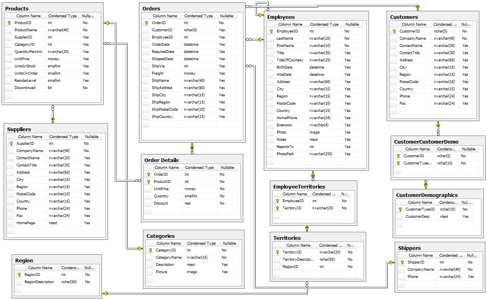

# Northwind 01

Consultas para la base de datos de Microsoft "Northwind". Originalmente para SQL Server pero portada a Oracle XE


#### Northwind
[](https://github.com/Microsoft/sql-server-samples/tree/master/samples/databases/northwind-pubs)
      
      
## Consultas  
 
1.Crear una consulta que muestre el nombre de empleado y el número de empleados que cada uno de los empleados tiene a su cargo. Tabla employees

```sql
SELECT
    e.lastname || ', ' || e.firstname AS "Nombre Completo",    
    (select count(*) from employees ee where ee.reportsto = e.employeeid) AS "Nºde Empleados"
FROM
    employees e
ORDER BY
    lastname; 
```
```sql
SELECT
    lastname || ', ' || firstname AS "Nombre Completo",
    "Nºde Empleados"
FROM
    employees e
INNER JOIN 
        (SELECT
            reportsto,
            count(employeeid) AS "Nºde Empleados"
        FROM
            employees
        GROUP BY
            reportsto
        ORDER BY
            reportsto) e1
        ON e1.reportsto = e.employeeid
ORDER BY
    lastname
```

2.Mostrar una consulta que muestre el nombre del producto, el número de unidades totales vendidas, de aquel producto del que mas unidades haya vendido la empresa. Tabla products y orderdetails
                 
```sql
WITH CTE_SUM_QTY AS (

SELECT
    productid,
    SUM(QUANTITY) AS CANTIDAD_VENDIDA     
FROM 
    orderdetails            
GROUP BY 
    productid
)

SELECT
    P.productname,
    CANTIDAD_VENDIDA
FROM
    products p
INNER JOIN
    CTE_SUM_QTY CTE        
    ON CTE.PRODUCTID = P.PRODUCTID
WHERE
    CANTIDAD_VENDIDA = (SELECT MAX(CANTIDAD_VENDIDA)
                        FROM CTE_SUM_QTY)
```
                        
```sql
SELECT
    p.productname,
    SUM(quantity)
FROM
    products p
INNER JOIN 
     orderdetails o
     ON o.productid = p.productid
GROUP BY
    p.productname
HAVING
    SUM(quantity) >= ALL
            (
            SELECT 
                SUM(o1.quantity)
            FROM
                orderdetails o1
            GROUP BY
                o1.productid
            )
```

3.Mostrar una consulta que obtenga el nombre completo de empleado, el número de pedidos que ha tramitado, y el dinero que ha generado en la empresa, de todos aquellos empleados que han tramitado pedidos. Ordenar según la cantidad de pedidos en orden descendente. En caso de existir algún empleado que no haya tramitado pedidos se mostrará en las columnas número de pedidos y generado un valor nulo. Tablas employees, orders, y orderdetails. Campos lastname,firstname,unitprice,quantity

```sql
SELECT
    e.lastname || ', ' || e.firstname AS "Nombre Completo",
    COUNT(o.orderid) AS "Nº de Pedidos",
    ROUND(SUM(oo.unitprice * oo.quantity),2) AS "Ventas"
FROM
    employees e
LEFT JOIN 
    orders o
    ON o.employeeid = e.employeeid
LEFT JOIN 
     orderdetails oo
     ON oo.orderid = o.orderid
GROUP BY
    e.lastname,
    e.firstname
ORDER BY
    COUNT(o.orderid) DESC
```

4.Modificar el ejercicio anterior para que muestre en los valores nulos de las columnas número de pedidos y dinero generado un 0.

```sql
SELECT
    e.lastname || ', ' || e.firstname AS "Nombre Completo",
    CASE 
        WHEN COUNT(o.orderid) IS NULL
        THEN 0
        ELSE COUNT(o.orderid)
        END AS "Nº de Pedidos",
    CASE
        WHEN SUM(oo.unitprice * oo.quantity) IS NULL
        THEN 0
        ELSE ROUND(SUM(oo.unitprice * oo.quantity),2)
    END AS "Dinero Generado"    
FROM
    employees e
LEFT JOIN 
    orders o
    ON o.employeeid = e.employeeid
LEFT JOIN 
     orderdetails oo
     ON oo.orderid = o.orderid
GROUP BY
    e.lastname,
    e.firstname
ORDER BY
    COUNT(o.orderid) DESC
```

5.Modificar el ejercicio anterior para que muestre en lugar de un 0 las cadenas "Sin Pedidos" y "Sin dinero".

```sql
SELECT
    e.lastname || ', ' || e.firstname AS "Nombre Completo",
    CASE 
        WHEN COUNT(o.orderid) IS NULL OR COUNT(o.orderid) = 0
        THEN 'Sin Pedidos'
        ELSE TO_CHAR(COUNT(o.orderid))
        END AS "Nº de Pedidos",
    CASE
        WHEN SUM(oo.unitprice * oo.quantity) IS NULL
        THEN 'Sin dinero'
        ELSE TO_CHAR(ROUND(SUM(oo.unitprice * oo.quantity),2))
    END AS "Dinero Generado"    
FROM
    employees e
LEFT JOIN 
    orders o
    ON o.employeeid = e.employeeid
LEFT JOIN 
     orderdetails oo
     ON oo.orderid = o.orderid
GROUP BY
    e.lastname,
    e.firstname
ORDER BY
    COUNT(o.orderid) DESC
```

6.Crear una consulta que muestre el nombre completo de empleado, el número de pedidos tramitado por cada empleado, de aquellos empleados que han tramitado mas de 15 pedidos. Ordenar según la cantidad de pedidos en orden descendente. Tablas employees, orders

```sql
SELECT
    e.lastname || ', ' || e.firstname AS "Nombre Completo",
    COUNT(o.orderid) Numero_de_Pedidos      
FROM
    employees e
INNER JOIN 
    orders o
    ON o.employeeid = e.employeeid
GROUP BY
    e.lastname,
    e.firstname
HAVING
    COUNT(o.orderid) > 15
ORDER BY
    Numero_de_Pedidos DESC  
```

7.Crear una consulta que muestre el nombre del cliente, el número de pedidos que nos ha realizado el cliente, el dinero que nos ha dejado en la empresa, de todos los clientes que sean de USA y que nos han realizado mas de 5 pedidos.Tablas customers, orders, orderdetails. Campos companyname, unitprice, quantity.

```sql
SELECT
   c.companyname AS "Nombre",
   count(o.orderid) AS "Nº de Pedidos",
   ROUND(SUM(oo.unitprice * oo.quantity),2) AS "Ventas"
FROM
    customers c
INNER JOIN 
    orders o
    ON o.customerid = c.customerid    
INNER JOIN 
     orderdetails oo
     ON oo.orderid = o.orderid
WHERE
    c.country = 'USA'
GROUP BY
    c.customerid,
    c.companyname
HAVING
    COUNT(o.orderid) > 5
ORDER BY
    COUNT(o.orderid) DESC
```

8.Crear una consulta que muestre ID, nombre completo del jefe y el número de empleados a su cargo de aquel jefe que mas empleados tenga a su cargo. Tabla employees

```sql
SELECT
    e.reportsto AS "Jefe Id",
    ee.lastname || ', ' || ee.firstname AS "Nombre Completo",
    COUNT(*) AS "Nº de Empleados"
FROM
    employees e
INNER JOIN
    employees ee
    ON ee.employeeid = e.reportsto
GROUP BY
    e.reportsto,
    ee.lastname,
    ee.firstname
HAVING
    COUNT(*) >= ALL
            (
            SELECT COUNT(*)
            FROM employees
            GROUP BY reportsto
            )
```

9.Obtener el nombre de la compañia y el número de pedidos del cliente que mas pedidos ha realizado en la empresa.Tablas customers, orders. Campos companyname

```sql
SELECT
   c.companyname AS "Nombre",
   COUNT(o.orderid) AS "Nº de Pedidos"
FROM
    customers c
INNER JOIN 
    orders o
    ON o.customerid = c.customerid
GROUP BY
    c.companyname
HAVING 
    COUNT(o.orderid) >= ALL
                (
                SELECT
                    COUNT(*)
                FROM
                    orders
                GROUP BY
                    customerid
                )
```

```sql
WITH CTL_COUNT_ORDERS AS (
SELECT 
    COUNT(orderid) AS CUENTEO_ORDERS, 
    customerid
FROM 
    orders
GROUP BY 
    customerid
)

SELECT
    c.companyname,
    CUENTEO_ORDERS
FROM
    customers c
INNER JOIN 
    CTL_COUNT_ORDERS o
    ON o.customerid = c.customerid
WHERE
    CUENTEO_ORDERS = (
                     SELECT MAX(CUENTEO_ORDERS)
                     FROM CTL_COUNT_ORDERS
                     )
```

10.Obtener el nombre de la compañia y el volumen de negocio del cliente que mas volumen de negocio nos ha dejado en la empresa. Tablas customers, orders, orderdetails.

```sql
SELECT
   c.companyname AS "Nombre",
   ROUND(SUM(oo.unitprice * oo.quantity),2) AS "Dinero Generado" 
FROM
    customers c
INNER JOIN 
    orders o
    ON o.customerid = c.customerid
INNER JOIN 
     orderdetails oo
     ON oo.orderid = o.orderid
GROUP BY
    c.companyname
HAVING 
    ROUND(SUM(oo.unitprice * oo.quantity),2) >= ALL
                (
                SELECT
                    ROUND(SUM(unitprice * quantity),2)
                FROM
                    orderdetails o1 
                INNER JOIN 
                    orders o2
                    ON o2.orderid = o1.orderid
                GROUP BY
                    customerid
                )
```

```sql
WITH CTE_SUMATORY_PER_ORDER AS (
SELECT
    orderid,
    SUM(quantity * unitprice) AS TOTAL_PEDIDO
FROM
    orderdetails
GROUP BY
    orderid
),

CTE_SUMATORY_PER_COMPANY AS (
SELECT
    o.customerid,
    SUM(CTE_SPO.TOTAL_PEDIDO) AS TOTAL_CLIENTE
FROM
    CTE_SUMATORY_PER_ORDER CTE_SPO
INNER JOIN 
    orders o
    ON o.orderid = CTE_SPO.orderid
GROUP BY
    o.customerid
)

SELECT
   c.companyname AS NOMBRE_EMPRESA,
   TOTAL_CLIENTE
FROM
    customers c
INNER JOIN 
    CTE_SUMATORY_PER_COMPANY CTE_SPC
    ON CTE_SPC.customerid = c.customerid
WHERE
    TOTAL_CLIENTE >= ALL
                    (
                    SELECT TOTAL_CLIENTE
                    FROM CTE_SUMATORY_PER_COMPANY
                    )
```
                    