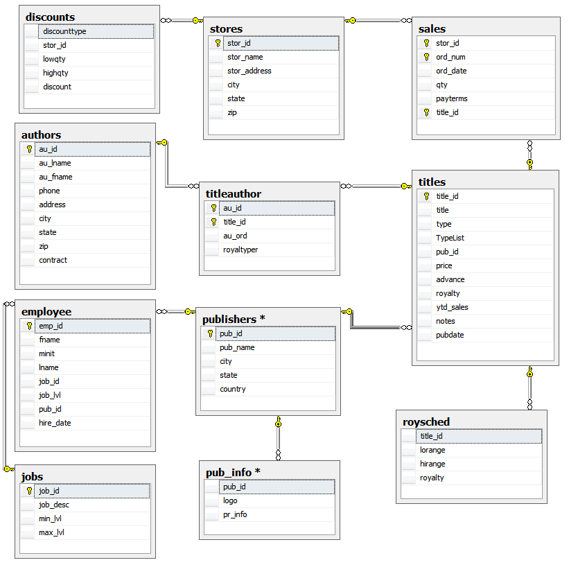

# Pubs 01

Consultas para la base de datos de Microsoft "Pubs". Originalmente para SQL Server pero portada a Oracle XE

[](https://github.com/Microsoft/sql-server-samples/tree/master/samples/databases/northwind-pubs)
 
## Uso
   	   
- Lanzar desde dentro de la carpeta principal "Northwind & Pubs" para crear la BD:
   
```bash
docker run -d --name oracle-sql-pub \
-p 1521:1521 -p 5500:5500 \
-e ORACLE_PWD=12345 \
-v oracle-sql-pub-vol:/opt/oracle/oradata \
-v .:/opt/oracle/scripts/startup \
container-registry.oracle.com/database/express:21.3.0-xe
```

- Parar o arrancar el contenedor previamente creado

```bash
docker stop oracle-sql-pub
docker start oracle-sql-pub
```
   
- Datos de conexión

```
host: localhost
database: xe
user: sys
role: sysdba
password: 12345
```
   
## Consultas   

1 Usar Base de Datos Pubs. Para recuperar la información de un autor cuyo ID comienza con el numero 724, sabiendo que cada ID tiene el formato de tres dígitos seguidos por un guión, seguido por dos dígitos, otro guión y finalmente cuatro dígitos. Utilizar el comodín _ .

```sql
SELECT
    * 
from 
    AUTHORS
WHERE 
    au_id LIKE '724-__-____'
ORDER BY
    au_id
```

2 Usando la base de datos PUBS. Calcula la suma de las ventas hasta la fecha de hoy (ytd_sales) de todos los libros de la tabla titles . 

```sql
SELECT
    SUM(ytd_sales) AS "Ventas"
FROM 
    titles
```

3 Usando la base de datos PUBS. Puede averiguar el precio promedio de todos los libros si se duplicaran los precios ( tabla titles ). 

```sql
SELECT
    ROUND(AVG(price*2),2) AS "Promedio"
FROM 
    titles
```

4 Usando la base de datos PUBS. Cuente las filas de la tabla titles. 

```sql
SELECT
    COUNT(*) AS "Nº DE FILAS"
FROM 
    titles
```

5 Utilizando la base de datos PUBS y la tabla titles. Liste las suma de las ventas por año ( ytd_sales ) hasta la fecha, clasificándolas por tipo (TYPE). 

```sql
SELECT
   INITCAP(t.type) AS "Tipo",
   COALESCE(SUM(t.ytd_sales),0) AS "Ventas"
FROM 
    titles t
GROUP BY
    t.type
ORDER BY
    "Ventas" DESC
```

6 Liste las sumas de las ventas por año (ydt_sales) hasta la fecha, clasificándolas por tipo (TYPE) y pub_id.

```sql
SELECT
    CASE
        WHEN SUM(ytd_sales) IS NULL
            THEN 0
            ELSE SUM(ytd_sales)
    END AS "Ventas",
    INITCAP(t.type) AS "Tipo",
    pub_id
FROM 
    titles t
GROUP BY
    t.type,
    pub_id
ORDER BY
    pub_id,
    "Ventas" DESC
```

7 Utilizando el ultimo ejemplo. Liste solamente los grupos cuyo pub_id sea igual a 0877. Pista, usar having

```sql
SELECT
    CASE
        WHEN SUM(ytd_sales) IS NULL
            THEN 0
            ELSE SUM(ytd_sales)
    END AS "Ventas",
    INITCAP(t.type) AS "Tipo",
    pub_id
FROM 
    titles t
GROUP BY
    t.type,
    pub_id
HAVING
    pub_id = '0877'
ORDER BY
    pub_id,
    "Ventas" DESC
```

8 De la base de datos PUBS. Combine las tablas stores y discounts para mostrar que tienda (stor_id) ofrece un descuento y el tipo de descuento (discounttype).

```sql
SELECT
    s.stor_id AS "ID Tienda",
    s.stor_name AS "Nombre",
    d.discounttype AS "Tipo de Descuento",
    d.discount AS "Descuento"
FROM 
    stores s
INNER JOIN
    discounts d
    ON d.stor_id = s.stor_id
ORDER BY
    s.stor_id
```

9 Utilice el mismo ejemplo anterior solo utilice en el FROM la instrucción FULL OUTER JOIN. 

```sql
SELECT
    s.stor_id AS "ID Tienda",
    s.stor_name AS "Nombre",
    d.discounttype AS "Tipo de Descuento",
    d.discount AS "Descuento"
FROM 
    stores s
FULL OUTER JOIN
    discounts d
    ON d.stor_id = s.stor_id
WHERE
    d.stor_id IS NOT NULL    
ORDER BY
    s.stor_id
```

10 Utilice el mismo ejemplo anterior solo utilice en el FROM la instrucción LEFT OUTER JOIN. 

```sql
SELECT
    s.stor_id AS "ID Tienda",
    s.stor_name AS "Nombre",
    d.discounttype AS "Tipo de Descuento",
    d.discount AS "Descuento"
FROM 
    stores s
LEFT OUTER JOIN
    discounts d
    ON d.stor_id = s.stor_id
WHERE
    d.stor_id IS NOT NULL    
ORDER BY
    s.stor_id
```

11 Utilice el mismo ejemplo anterior solo utilice en el FROM la instrucción RIGHT OUTER JOIN. 

```sql
SELECT
    s.stor_id AS "ID Tienda",
    s.stor_name AS "Nombre",
    d.discounttype AS "Tipo de Descuento",
    d.discount AS "Descuento"
FROM 
    stores s
RIGHT OUTER JOIN
    discounts d
    ON d.stor_id = s.stor_id
WHERE
    d.stor_id IS NOT NULL    
ORDER BY
    s.stor_id
```

